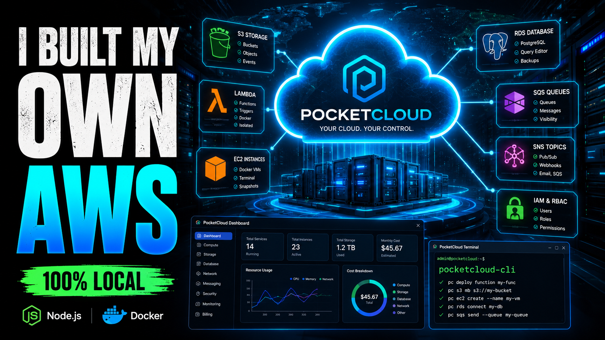

<div align="center">

# ☁️ PocketCloud

### A fully-featured local AWS simulator built from scratch

🚀 Built 14 AWS-inspired cloud services from scratch using Node.js, Docker, PostgreSQL, IAM/RBAC, Event-Driven Architecture, and Local AI.


**Run AWS-like cloud infrastructure entirely on your laptop. No AWS account. No costs. No internet required.**

[Features](#-features) • [Quick Start](#-quick-start) • [Services](#-services) • [Architecture](#-architecture) • [RBAC](#-rbac--iam)

</div>

---

# 🎥 Live Demo

<div align="center">

<a href="https://youtu.be/TbbnS-Kt-oY">
  
</a>

</div>

### ▶️ Click the image above to watch the full demo

See PocketCloud in action: S3, Lambda, EC2, RDS, IAM/RBAC, AI Functions, Docker-powered infrastructure, CloudWatch, Billing Simulator, and more.

</div>

---
## 🤔 What is PocketCloud?

PocketCloud is a **local cloud infrastructure simulator** that replicates core AWS services on your own machine. Built entirely from scratch to demonstrate deep understanding of cloud architecture, distributed systems, Docker, event-driven design, and enterprise security (RBAC/IAM).

Think of it as **LocalStack** — but built from scratch, with a full web dashboard, CLI tool, AI-powered functions, real Docker containers acting as EC2 instances, and a complete IAM/RBAC system.

```
Your App
   ↓
PocketCloud (localhost:4566)
   ↓
┌──────────────────────────────────────────────────┐
│  S3  │  EC2  │  RDS  │  Lambda  │  SQS  │  SNS  │
│  VPC │  IAM  │  RBAC │  Secrets │  Cron │  AI   │
└──────────────────────────────────────────────────┘
```

---

## ✨ Features

### Cloud Services
- 🪣 **S3 Clone** — Bucket management, file upload/download, event triggers
- ⚡ **Lambda Functions** — Docker-isolated execution, deploy from browser
- 📨 **SQS Queues** — Message queuing with visibility timeouts
- 📢 **SNS Topics** — Pub/Sub with HTTP, email, and SQS subscribers
- 🗄️ **RDS Clone** — Real PostgreSQL containers, SQL editor in browser
- 🖥️ **EC2 Instances** — Real Docker containers as VMs, browser terminal
- 🌐 **VPC + Subnets** — Virtual networks, public/private subnets
- 🔒 **Security Groups** — Editable inbound/outbound rules (real firewall)
- 🔑 **Secrets Manager** — AES-256 encrypted storage with versioning
- ⏱️ **Cron Scheduler** — Schedule functions automatically
- 🌐 **API Gateway** — Route and proxy HTTP requests
- 📊 **CloudWatch** — Real-time metrics, request tracking
- 💰 **Billing Simulator** — Track simulated costs per service
- 🤖 **AI Functions** — Ollama/Llama3.2 powered file analysis (100% local)

### Security & Identity
- 🔐 **Full IAM System** — Users, Roles, and granular Permissions
- 🎭 **RBAC** — Role-Based Access Control enforced on every API endpoint
- 👑 **4 Built-in System Roles** — Admin, Developer, DevOps, Read Only
- 🛠️ **Custom Roles** — Create roles with any combination of permissions
- 🔑 **28 Granular Permissions** — Per service, per action
- 🚦 **Permission Enforcement** — Every API request checked; 403 with helpful error message
- 🖥️ **Roles & Permissions UI** — Dedicated tabs in the dashboard

### Developer Experience
- 🖥️ **Web Dashboard** — AWS Console-like UI
- 🐳 **Docker Compose** — One command startup
- 💻 **CLI Tool** — `pocketcloud bucket list` just like AWS CLI
- 🔑 **API Key Auth** — Like AWS access keys

---

## 🚀 Quick Start

### Prerequisites
- [Docker Desktop](https://www.docker.com/products/docker-desktop/)
- [Node.js 18+](https://nodejs.org/)
- Git

### One Command Setup

```bash
# Clone the repo
git clone https://github.com/yourusername/pocketcloud.git
cd pocketcloud

# Create data files
mkdir -p data
echo '{}' > data/keys.json
echo '{}' > data/users.json
echo '{}' > data/queues.json
echo '{}' > data/crons.json
echo '{"instances":{}}' > data/rds.json
echo '{"instances":{}}' > data/ec2.json
echo '{"vpcs":{},"subnets":{},"securityGroups":{}}' > data/vpc.json
echo '{"topics":{}}' > data/sns.json
echo '{}' > data/secrets.json
echo '{"roles":{}}' > data/iam.json
echo '{"rules":[{"id":"rule-1","bucket":"uploads","event":"PUT","function":"logger-fn","enabled":true}]}' > data/triggers.json

# Start everything
docker-compose up --build
```

Open browser: **http://localhost:4566**

First time? Click **"First Setup"** → create admin account → you're in!

---

## 🔐 RBAC / IAM

PocketCloud implements a full **Role-Based Access Control** system modeled after AWS IAM — users, roles, and granular permissions, enforced on every single API request.

### How it works

```
👤 Users
  └── assigned Roles
🎭 Roles
  └── contain Permissions
🔑 Permissions
  ├── s3:read / s3:write / s3:delete
  ├── ec2:launch / ec2:terminate
  ├── rds:create
  ├── lambda:invoke
  ├── iam:admin
  └── *:* (full access)
🚦 Every API request checks:
  "Does this user have permission for this action?"
```

### Built-in System Roles

| Role | Description | Key Permissions |
|---|---|---|
| 👑 **Admin** | Full control over everything | `*:*` |
| 💻 **Developer** | App services, no infra admin | `s3:*` `lambda:*` `sqs:*` `sns:*` |
| 🔧 **DevOps** | Infrastructure + deployments | `ec2:*` `rds:*` `vpc:*` `lambda:*` |
| 📖 **Read Only** | View everything, change nothing | all `:read` permissions |

### Custom Roles

Beyond the built-ins, you can create any role with any combination of the 28 available permissions — scoped exactly to what a user needs.

### 28 Granular Permissions

Permissions follow the `service:action` pattern and cover every service:

| Service | Permissions |
|---|---|
| S3 | `s3:read` `s3:write` `s3:delete` |
| EC2 | `ec2:read` `ec2:launch` `ec2:stop` `ec2:terminate` |
| RDS | `rds:read` `rds:create` `rds:delete` |
| Lambda | `lambda:read` `lambda:invoke` `lambda:deploy` |
| VPC | `vpc:read` `vpc:create` `vpc:delete` |
| SQS | `sqs:read` `sqs:send` `sqs:delete` |
| SNS | `sns:read` `sns:publish` `sns:manage` |
| Secrets | `secrets:read` `secrets:write` |
| IAM | `iam:admin` |
| Billing | `billing:read` |
| *(wildcard)* | `*:*` (full access) |

### Permission Enforcement

Every API request is checked before it's processed:

```
User logs in
     ↓
Admin assigns role (or custom permissions)
     ↓
Every API request checks permission
     ↓
✅ Allowed → request proceeds
❌ Denied  → 403 with helpful message
```

**Example — Developer trying to launch an EC2 instance:**

```json
{
  "error": "Access denied",
  "required": "ec2:launch",
  "yourRole": "developer",
  "hint": "You need ec2:launch permission. Ask an admin to assign you the DevOps or Admin role."
}
```

### EC2 Permission Matrix

| Action | Admin | DevOps | Developer | Read Only |
|---|---|---|---|---|
| View instances | ✅ | ✅ | ✅ | ✅ |
| Launch instance | ✅ | ✅ | ❌ | ❌ |
| Stop instance | ✅ | ✅ | ❌ | ❌ |
| Run commands | ✅ | ✅ | ❌ | ❌ |
| Terminate | ✅ | ✅ | ❌ | ❌ |

### Dashboard

The IAM section of the dashboard includes a **Roles tab** to manage and assign roles, and a **Permissions reference tab** listing all 28 permissions with descriptions.

---

## 🛠️ Services

### 📦 S3 — Object Storage

```bash
POST   /buckets/:name                    # Create bucket
PUT    /buckets/:name/objects/:key       # Upload file
GET    /buckets/:name/objects/:key       # Download file
GET    /buckets/:name/objects            # List files
DELETE /buckets/:name/objects/:key       # Delete file
```

Upload a file → trigger fires → Lambda function runs automatically.

---

### 🖥️ EC2 — Virtual Machines

Each instance is a **real Docker container** running Ubuntu, Alpine, Node.js, or Nginx.

```
Launch instance → Docker container starts
      ↓
Browser terminal → run real Linux commands
      ↓
apt-get install nginx → real web server running
```

Security groups control which ports are exposed — add/remove rules from the dashboard.

---

### 🌐 VPC — Networking

```
VPC: 10.0.0.0/16
├── Public Subnet:  10.0.1.0/24
└── Private Subnet: 10.0.2.0/24
    └── Security Groups
        ├── Inbound: TCP:22, TCP:80, TCP:443
        └── Outbound: All traffic
```

Security group rules are **actually enforced** — ports are bound to Docker containers based on your rules.

---

### 🤖 AI Functions

Upload a `.txt` file to `ai-uploads` bucket → Llama3.2 analyzes it automatically:

```json
{
  "summary": "This document describes...",
  "topics": ["cloud", "infrastructure"],
  "sentiment": "positive",
  "tags": ["pocketcloud", "aws"],
  "language": "English"
}
```

Runs **100% locally** with Ollama. No API keys, no data leaves your machine.

---

### 💰 Billing Simulator

Every API call tracks a simulated cost:

| Service | Operation | Price |
|---|---|---|
| S3 | PUT request | $0.000005 |
| Lambda | Invocation | $0.0000002 |
| EC2 t2.micro | Per hour | $0.0116 |
| RDS | Per hour | $0.017 |
| SQS | Per message | $0.0000004 |

---

## 🖥️ CLI Tool

```bash
# Create bucket
pocketcloud bucket create my-bucket

# Upload file
pocketcloud upload ./file.txt my-bucket

# List files
pocketcloud list-objects my-bucket

# Download
pocketcloud download my-bucket file.txt

# List all buckets
pocketcloud bucket list
```

---

## 🏗️ Architecture

```
┌─────────────────────────────────────────────────────┐
│                   Browser Dashboard                  │
│         (Vanilla JS · JetBrains Mono · Dark UI)      │
└──────────────────────┬──────────────────────────────┘
                       │ HTTP + API Keys
┌──────────────────────▼──────────────────────────────┐
│              Express.js API Server (:4566)           │
│                                                      │
│  Auth → IAM/RBAC Check → Route Handler              │
│                                                      │
│  S3  │ SQS  │ SNS  │ Lambda │ Secrets │ Cron        │
│  EC2 │ VPC  │ RDS  │ Gateway│ Metrics │ Billing     │
└──────┬───────────────────────────────────────────────┘
       │
┌──────▼───────────────────────────────────────────────┐
│                    Docker Engine                     │
│  ┌───────────┐  ┌───────────┐  ┌───────────────┐   │
│  │ Lambda Fn │  │EC2 Ubuntu │  │ RDS PostgreSQL│   │
│  │ Container │  │ Container │  │   Container   │   │
│  └───────────┘  └───────────┘  └───────────────┘   │
└─────────────────────────────────────────────────────┘
       │
┌──────▼───────────────────────────────────────────────┐
│               Local File System                      │
│  storage/ │ keys.json │ vpc.json │ iam.json          │
└─────────────────────────────────────────────────────┘
```

---

## 📁 Project Structure

```
pocketcloud/
├── server/
│   ├── src/
│   │   ├── routes/        # API endpoints
│   │   ├── auth/          # JWT + API key auth
│   │   ├── iam/           # IAM + RBAC system
│   │   ├── billing/       # Cost tracking
│   │   ├── cron/          # Scheduler
│   │   ├── docker/        # Lambda runner
│   │   ├── ec2/           # EC2 engine
│   │   ├── gateway/       # API Gateway
│   │   ├── metrics/       # CloudWatch
│   │   ├── middleware/    # Auth, IAM, metrics
│   │   ├── queues/        # SQS
│   │   ├── rds/           # RDS engine
│   │   ├── secrets/       # Encrypted secrets
│   │   ├── sns/           # SNS pub/sub
│   │   ├── triggers/      # Event engine
│   │   └── vpc/           # VPC + networking
│   ├── functions/
│   │   ├── logger-fn/
│   │   ├── ai-analyzer-fn/
│   │   └── json-validator-fn/
│   └── public/            # Dashboard UI
├── cli/                   # CLI tool
├── data/                  # Persisted data
└── docker-compose.yml
```

---

## 🧰 Tech Stack

| Layer | Technology |
|---|---|
| Runtime | Node.js 18 |
| Framework | Express.js |
| Containers | Docker + Dockerode |
| Database | PostgreSQL (via Docker) |
| Auth | JWT + bcryptjs |
| Encryption | AES-256-CBC |
| Scheduling | node-cron |
| AI | Ollama + Llama3.2 |
| Dashboard | Vanilla JS + CSS Variables |
| Deploy | Docker Compose |

---

## 🤝 Why I Built This

Instead of just *using* AWS, I wanted to *build* the systems that make it work:

- How does S3 store and retrieve objects?
- How does Lambda isolate function execution in containers?
- How does EC2 provision and manage virtual machines?
- How do security groups control network access?
- How does IAM enforce permissions across every service?

Every service in PocketCloud answers one of these questions with real, working code.

---

## 📄 License

MIT — free to use for learning, portfolios, or local development.

---

<div align="center">

## 🌟 Why This Project Stands Out

PocketCloud isn't a UI mockup or tutorial clone.

It is a working cloud platform that simulates core AWS services using real containers, networking, event processing, authentication, authorization, and infrastructure orchestration.

The project was built to deeply understand how cloud providers operate internally rather than simply consuming cloud services.

Every service, permission check, container lifecycle, event trigger, scheduler, and billing calculation was implemented from scratch.

## 👤 About Me

<div align="center">

**Ammar** | DevOps & Cloud Security Engineer

I'm passionate about building secure, scalable infrastructure on AWS and automating everything that can be automated. This project is part of my portfolio of hands-on cloud engineering work.

[](https://github.com/Ammar-DevopsSecurity)
[](https://www.linkedin.com/in/ammar-devopssecurity-82510340a)

</div>

---

<div align="center">

Built with ☁️ by **Ammar-DevopsSecurity**

⭐ **Star this repo if you found it useful!**

</div># pocketcloud
